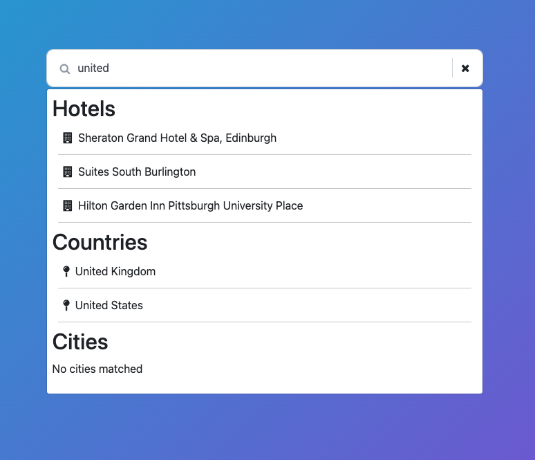

# Accommodation Search

## Technical Coding Test

This project has a simple setup with an api, hooked up to MongoDB and a frontend piece initiated with [vite](https://vitejs.dev/).

## Install and run

From the project root:

```
npm install
```

### Run

Once install has finished, you can use the following to run both the API and UI:

```
npm run start
```

### API

To run the API separately, navigate to the `./packages/api` folder

```
$ cd packages/api
```

And run the `api` server with

```
$ npm run dev
```

The API should start at http://localhost:3001

### Client

To run the `client` server separately, navigate to the `./packages/client` folder

```
$ cd ./packages/client
```

And run the `client` with

```
$ npm run start
```

The UI should start at http://localhost:3000

### Database connection & environment variables

By default, the code is set up to start and seed a MongoDB in-memory server, which should be sufficient for the test. The database URL will be logged on startup, and the seed data can be found at ./packages/api/db/seeds.

If this setup does not work for you or if you prefer to use your own MongoDB server, you can create a .env file. In the ./packages/api folder, create a .env file (or rename the existing .env.sample) and fill in the environment variables.

## Task at hand

When the project is up and running, you should see a search-bar on the screen. This one is currently hooked up to the `/hotels` endpoint.
When you type in a partial string that is part of the name of the hotel, it should appear on the screen.
Ie. type in `resort` and you should see some Hotels where the word `resort` is present.

You will also see 2 headings called **"Countries"** and **"Cities"**.

The assignment is to build a performant way to search for Hotels, Cities or Countries.
Partial searches will be fine. Hotels will need to filterable by location as well.
Ie. The search `uni` should render

-   Hotels that are located in the United States, United Kingdom or have the word `uni` in the hotel name.
-   Countries that have `uni` in their name Ie. United States, United Kingdom
-   No Cities as there is no match

Clicking the close button within the search field should clear out the field and results.

When clicking on one of the `Hotels`, `Cities` or `Countries` links, the application should redirect to the relevant page and render the selected `Hotel`, `City` or `Country` as a heading.

### Limitations

Given the time constraints, we do not expect a fully production-ready solution. We're primarily interested in the approach and the overall quality of the solution.
Feel free to modify the current codebase as needed, including adding or removing dependencies.
For larger or more time-intensive changes, you're welcome to outline your ideas in the write-up section below and discuss them further during the call.



### Write-up

<!-- Write-up/conclusion section -->

1. In a normal DB implementation, the idea would be to have some of the search fields on Mongo indexed. Not something to wory too much about for this example, but would be essential in a prod system.
2. I use a RegEx search pattern in the filtering of the Mongo data. This helps with not getting all the data and then running the filtering on the full dataset.
3. I limit the number of search results to 10 per entity, just so it's not a wall of data for the user.
4. I initialize the DB and connect just the once to the DB for the entirety of the server being up. IMO a better way of managing the DB connection.
5. I also cache the collections for slightly better, maybe slightly more performant queries against the data.
6. I have tried to componentise the application a best possible in the time I allowed myself.
7. Created some custom hooks to try and make the application a little more performant, as well debouncing to reduce the number of API calls.
8. Using React router in order to be able to link off ot hte pages when the item is clicked.
9. The close button now clears teh search input and serach results.
10. Better error handling is needed in the pages, but for now it does what is requested.
11. Testing would need to be added, for both the back end services as well as the front end components. Using Vitest is a good way to go, but additionally, I would recommend using Storybook as we used it at my previous place of employment, and it helps speed up front-end dev. Helpful to see components before fully implemented too, so you can resolve unseen issues, or even fail fast in a cycle. I haven't added any tests as I only had about half a day to do the test, but something that definitely would be needed.

Can't think of anything else right now, but would like to thank all involved for the opportunity of partaking in this test. It's been an enjoyable one, and I hope that I've completed it to a satisfactory level.

### Database structure

#### Hotels Collection

```json
[
    {
        "chain_name": "Samed Resorts Group",
        "hotel_name": "Sai Kaew Beach Resort",
        "addressline1": "8/1 Moo 4 Tumbon Phe Muang",
        "addressline2": "",
        "zipcode": "21160",
        "city": "Koh Samet",
        "state": "Rayong",
        "country": "Thailand",
        "countryisocode": "TH",
        "star_rating": 4
    },
    {
        /* ... */
    }
]
```

#### Cities Collection

```json
[
    { "name": "Auckland" },
    {
        /* ... */
    }
]
```

#### Countries Collection

```json
[
    {
        "country": "Belgium",
        "countryisocode": "BE"
    },
    {
        /* ... */
    }
]
```
